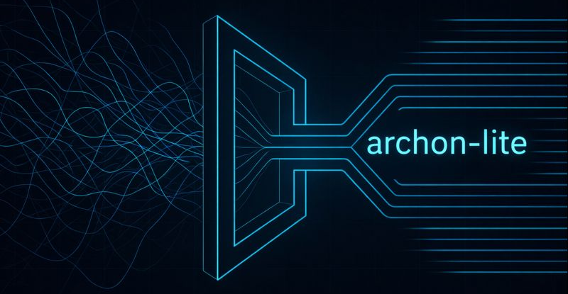

# Archon-Lite

**Compiler-grade governance for AI-assisted development.**

> The AI is not trusted. The compiler is.

  

---

## ⭐ Star This Repo

**Star to get notified when Archon-Lite goes live.**

The compiler engine is currently in private development. Public release is planned once the CLI interface is production-hardened.

[Join the discussion →](../../discussions/1) — feedback on the philosophy and design is welcome now.

---

## The Problem: The "10x Review" Trap

Here's the frustrating paradox we're all living right now: AI code generation has hit terminal velocity, but the time we spend *verifying* that code has absolutely skyrocketed.

I call this the **10x review burden**.

We're drowning in what I think of as "probabilistic hallucinations"—not model hallucinations in the abstract sense, but the very real kind: invented file paths, schema assumptions that don't match reality, and architectural violations that look plausible until they blow up in production.

Most modern AI tools optimize for *generation* at the expense of *correctness*. They operate on vibes—statistical guesses about what might work—rather than deterministic engineering principles. No concept of invariants. No awareness of existing provenance. No structural proof.

**Archon-Lite takes a different approach:** stop treating AI as a conversational partner and start treating it as a component of a compiler.

---

## The Philosophy: From "AI Vibes" to "Compiler-Grade"

### 1. The AI is a Specialist Under Contract

Traditional AI assistants rely on behavioral prompting—essentially *begging* the model to "follow rules" or "be concise"—which is fundamentally fragile. Archon shifts the burden of safety from the model's behavior to the system's structure.

By treating the AI as a specialist under contract, we constrain the model within explicit, hardcoded boundaries. The state machine, not the model, is the final arbiter of what enters the codebase.

**Structural enforcement is superior to behavioral enforcement.** A prompt can be ignored; a compiler invariant cannot. If a model attempts to violate a structural constraint, the process doesn't just "warn" the user—it blocks execution entirely. The model becomes a powerful but untrusted engine, functioning only within the rails provided by the compiler.

Models are replaceable; invariants are not.

---

### 2. The "Linker" Stage: Ending Hallucinations with Deterministic Discovery

A critical failure in vibe-based coding is the invention of file paths and non-existent symbols. Archon addresses this through the **Discovery Phase**, which acts as the "Linker" stage of the development compiler.

Before a single line of code is planned, the system performs deterministic repository reconnaissance.

By utilizing AST (Abstract Syntax Tree) based scanning, Archon extracts absolute truth directly from the source. This is not heuristic search; it is deterministic extraction of ground truth. If the scanner determines a field is a `CharField` and not a `ForeignKey`, the AI is structurally prohibited from treating it otherwise.

**The Discovery phase uncovers authoritative facts via a multi-pass process:**

| Pass | Purpose |
|------|---------|
| **Authoritative Model Scanning** | Extract exact schemas and relationships from the code, preventing the AI from inventing ORM relationships that don't exist. |
| **Interaction Ownership Binding** | Determine which file executes the intent logic versus which one merely renders it. Evidence-based binding, not guessing. |
| **Schema Sufficiency** | Deterministic analysis of whether a change requires a migration. If `migration_required: false`, the planner is structurally blocked from even *proposing* a database change. |
| **Deterministic File Enumeration** | No file references without provenance. If a file wasn't discovered during reconnaissance, it does not exist to the AI. |

---

### 3. The Four-Layer Governance Engine

To make AI trustworthy enough for production, Archon utilizes a graduated governance architecture. This engine moves the workflow through a hierarchy of deterministic checks, ensuring that vibes are replaced by state machine enforcement.

| Layer | Definition | Enforcement |
|-------|------------|-------------|
| **L0: Structural Invariants** | Hardcoded, non-configurable compiler rules | G-001 through G-008. Non-negotiable. |
| **L1: Project Policy** | Machine-checkable, configurable project failures | Deterministic failures based on ProjectSpec. |
| **L2: Behavioral Analysis** | Advisory signals and warnings | Non-blocking signals like "Complexity Spike." Advisory only. |
| **L3: Human Governance** | Explicit pauses for structural ambiguity | The "Type Cast": Human decisions recorded as authoritative truth. |

**Key insight: User Resolution as Type Cast.** When Archon hits structural ambiguity—say, multiple valid frontend placements for a new interaction—it doesn't guess. It pauses. The human's resolution isn't just "feedback"; it is a state change that the compiler treats as authoritative grounding, pruning the state space for all subsequent phases.

---

### 4. The Fixability Contract

Not all governance violations are created equal. Archon classifies every failure through a rigorous Fixability Contract:

| Classification | Behavior | Example |
|----------------|----------|---------|
| **AUTO** | Deterministic, mechanical fixes applied automatically | Minor formatting violations |
| **HUMAN** | Workflow pauses for human Type Cast | Security mutations, structural ambiguities |
| **NEVER** | Cardinal sins—abort the intent entirely | Modifying generated files, writing outside declared scope |

The **NEVER** classification is vital. In traditional tools, an AI might "fix" a migration file or a generated protobuf, poisoning the repository's source of truth. Archon treats these as fatal compilation errors, forcing the developer to address the source rather than the symptom.

---

### 5. Domain Registry: The Symbol Table

AI models are notorious for inventing synonyms. "Insight" vs. "Alert." "User" vs. "Customer" vs. "Account." This linguistic drift fragments codebases in subtle but compounding ways.

Archon solves this with the **Domain Registry**—a compiler-level symbol table defined in `.archon/domains.yaml`.

This registry enforces consistency by mapping presentation aliases to canonical names. The compiler strictly prohibits aliases in backend code while allowing approved aliases only in the frontend. Core business logic remains linguistically pure.

---

### 6. Intent Timeline: Audit-Grade Traceability

While traditional AI assistants offer transient chat history, Archon produces an **Intent Timeline**—an immutable event log where every intent, discovery pass, plan validation, and governance check is recorded with forensic-level detail.

Because the timeline is immutable, the system provides genuine provenance. If an error is corrected, it's recorded as a new event rather than a deletion of the old state. Critical for security, compliance, and leadership visibility.

**The compiler doesn't have vibes. Neither should your AI development workflow.**

---

## What Archon-Lite Will Include

- ✅ Full compiler engine
- ✅ AST-based discovery system
- ✅ Complete governance ruleset (G-001 through G-009)
- ✅ Intent timeline with immutable event logging
- ✅ Domain registry enforcement
- ✅ Lightweight, terminal-based interface

---

## The Bottom Line

The shift from "AI vibes" to "compiler invariants" marks the evolution of AI from a sophisticated autocomplete tool to a rigorous engineering partner. By focusing on verification over generation, we eliminate the 10x review burden and restore the structural integrity of our systems.

**If we wouldn't trust a human developer to push code without a compiler's check, why are we letting AI do it?**

---

## Get Involved

- ⭐ **Star this repo** to get notified at launch
- 💬 **[Join the Discussions](../../discussions)** to share feedback on the philosophy and design

---

## About

Archon-Lite is built by [Jeff Rhatigan]([https://www.linkedin.com/in/jeff-rhatigan/]) as the open-source CLI entry point to the Archon ecosystem—architecture-first developer tooling for the AI era.

Questions? Ideas? [Start a discussion →](../../discussions)
